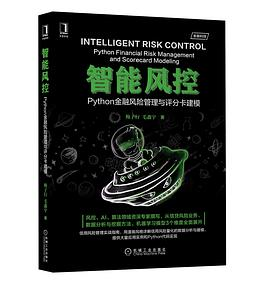
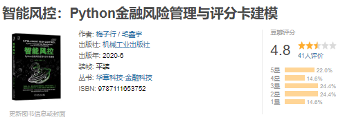

# python-risk-control
python智能风控

# 代码实现

这是代码实现，但是很多东西是我自己学习的时候查询和写的笔记，而不是这本书原本的内容，这本书原本的内容组织不恰当而且太松散了。

| 章节               | 内容                                                         | 实现                                                         |
| ------------------ | ------------------------------------------------------------ | ------------------------------------------------------------ |
| 信用管理基础       | 基础概念，术语，和架构                                       | [信用管理基础](https://github.com/YeJiu97/python-risk-control/blob/main/01%20-%20%E4%BF%A1%E7%94%A8%E7%AE%A1%E7%90%86%E5%9F%BA%E7%A1%80.ipynb) |
| 评分卡             | 评分卡设计，流程，模型搭建，数据与变量解读                   | [评分卡](https://github.com/YeJiu97/python-risk-control/blob/main/01%20-%20%E4%BF%A1%E7%94%A8%E7%AE%A1%E7%90%86%E5%9F%BA%E7%A1%80.ipynb) |
| 机器学习           | 基础概念，广义线性模型，逻辑回归，性能度量，部署，迭代与XGBoost | [机器学习](https://github.com/YeJiu97/python-risk-control/blob/main/03%20-%20%E6%9C%BA%E5%99%A8%E5%AD%A6%E4%B9%A0.ipynb) |
| 数据探索与特征工程 | 数据探索的基础概念，缺失值的处理，特征选择，WOE              | [数据探索与特征工程](https://github.com/YeJiu97/python-risk-control/blob/main/05%20~%2006%20-%20%E6%95%B0%E6%8D%AE%E6%8E%A2%E7%B4%A2%E4%B8%8E%E7%89%B9%E5%BE%81%E5%B7%A5%E7%A8%8B.ipynb) |
| 拒绝推断           | 拒绝推断                                                     | [拒绝推断](https://github.com/YeJiu97/python-risk-control/blob/main/07%20-%20%E6%8B%92%E7%BB%9D%E6%8E%A8%E6%96%AD.ipynb) |

# 评价

这是豆瓣上的书籍的评价：

这是我的评价：⭐/⭐⭐⭐⭐⭐

在深入阅读了这本书之后，我感到有必要分享一些个人的观点和感受。首先，我必须承认，书中的插画确实为这本书增添了不少色彩，毛鑫宇老师在这方面的努力是显而易见的。然而，尽管插画可能为没有基础的读者提供了一些视觉上的辅助，但它们对于希望获得实操指导的读者来说，其价值可能并不显著。

书名“智能风控”和副标题“金融风险管理”似乎有些夸大其词，因为书中的内容主要集中在小型和微型批发零售业企业的信贷风控架构上，这与“金融风险管理”这一宽泛的概念相比，显得有些局限。此外，尽管第二章对评分卡的介绍相对清晰，但第三章开始的机器学习内容却显得有些拼凑，缺乏深度和实操性。

书中的代码示例也引起了我的关注。将代码直接放在正文中的做法可能会让读者感到困惑，特别是对于那些不熟悉编程的读者来说。而且，根据一些读者的反馈，书中的代码存在错误，这可能会误导初学者。我理解作者可能希望展示实际操作，但这种做法可能并不是最佳选择。

此外，书中对关键概念的堆砌和对名词的过度使用，可能会让读者感到困惑，而不是得到清晰的指导。这种写作风格可能会让读者觉得作者在试图填充内容，而不是提供有价值的信息。

至于书中的推荐序，我个人认为，如果作者希望建立权威性，那么应该选择那些在该领域有真正经验和知识的专家来撰写。而不是仅仅依赖于一些可能缺乏实际经验的教授或副教授。

最后，我必须说，这本书给我的感觉是，它更像是一本拼凑起来的作品，而不是一本经过深思熟虑、精心编写的专业书籍。对于那些希望在智能风控领域深入学习的人来说，我建议寻找其他更为严谨和实用的资源。这本书可能更适合那些对风控领域一无所知的初学者，但对于希望获得实际操作指导的专业人士来说，它的价值有限。

总的来说，这本书在某些方面可能对初学者有所帮助，但在提供深入的专业知识和实操指导方面，它显然没有达到预期。对于那些希望在智能风控领域取得实质性进展的读者来说，可能需要寻找其他更为专业和权威的资源。
