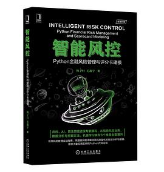
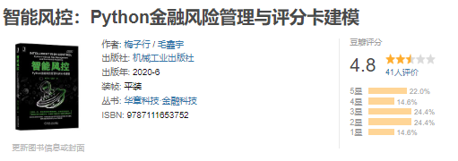

# python-risk-control
python智能风控

# 代码实现

这是代码实现，但是很多东西是我自己学习的时候查询和写的笔记，而不是这本书原本的内容，这本书原本的内容组织不恰当而且太松散了。

| 章节               | 内容                                                         | 实现                                                         |
| ------------------ | ------------------------------------------------------------ | ------------------------------------------------------------ |
| 信用管理基础       | 基础概念，术语，和架构                                       | [信用管理基础](https://github.com/YeJiu97/python-risk-control/blob/main/01%20-%20%E4%BF%A1%E7%94%A8%E7%AE%A1%E7%90%86%E5%9F%BA%E7%A1%80.ipynb) |
| 评分卡             | 评分卡设计，流程，模型搭建，数据与变量解读                   | [评分卡](https://github.com/YeJiu97/python-risk-control/blob/main/01%20-%20%E4%BF%A1%E7%94%A8%E7%AE%A1%E7%90%86%E5%9F%BA%E7%A1%80.ipynb) |
| 机器学习           | 基础概念，广义线性模型，逻辑回归，性能度量，部署，迭代与XGBoost | [机器学习](https://github.com/YeJiu97/python-risk-control/blob/main/03%20-%20%E6%9C%BA%E5%99%A8%E5%AD%A6%E4%B9%A0.ipynb) |
| 数据探索与特征工程 | 数据探索的基础概念，缺失值的处理，特征选择，WOE              | [数据探索与特征工程](https://github.com/YeJiu97/python-risk-control/blob/main/05%20~%2006%20-%20%E6%95%B0%E6%8D%AE%E6%8E%A2%E7%B4%A2%E4%B8%8E%E7%89%B9%E5%BE%81%E5%B7%A5%E7%A8%8B.ipynb) |
| 拒绝推断           | 拒绝推断                                                     | [拒绝推断](https://github.com/YeJiu97/python-risk-control/blob/main/07%20-%20%E6%8B%92%E7%BB%9D%E6%8E%A8%E6%96%AD.ipynb) |

# 评价

这是豆瓣上的书籍的评价：

这是我的评价：⭐/⭐⭐⭐⭐⭐

本书插画尚可，但内容与代码远未达标：未从真实业务场景切入，缺乏需求驱动的讲解，示例代码一股脑铺开，既无迭代也无工程化设计，部分实现疑似有误或因排版混乱而难用。书名“金融风险管理”过于宽泛，实则聚焦信贷风控，应更精准命名。

此外，推荐序若由业内实战专家撰写会更具说服力。全书给人拼凑之感，对零基础者略有启蒙，却难以满足专业人士对深度与实操的期待，建议另寻更系统、权威的智能风控资料。
